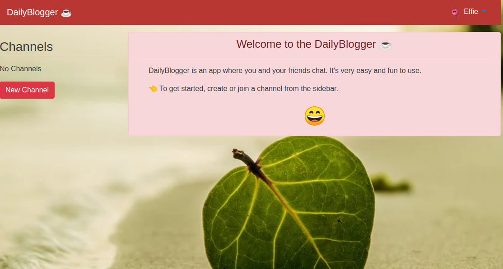

<h1 align = "center"> DAILY BLOGGER </h1>




This is a simple chat application where users create channels and join any of the available channels after they have creating a user account. It is built using Ruby on Rails.


## FEATURES
- Users can create accounts and login
- Users can create chat channels
- Users can join any of the channels created by other users
- Users can create their own chat channels
- Users can see other users' chats as long as they are  signed in
- Users can post their messages to the channels
- Users automatically get an avatar assigned to them when they sign up
- Users can sign out of the application

## FUTURE FEATURES
In future, I hope to implement the following features to this application
- A user shall be able to signup/ sign in with valid and existent email addresses
- A user will be able to delete and edit their messages
- A user will be able to geta notification for an incoming message
- A user will be able to view the number of unread messages fron the groups they are part of.
- A user will be able to invite people to join his group.
- Joining the channels will be by invitation from the admin of the group.

## [DEMO LINK](https://dailyblogger.herokuapp.com/users/sign_in)

## TECHNOLOGIES
- Git
- Ruby on Rails
- JavaScript
- HTML
- CSS
- Bootstrap 4
- PostgreSQL
- Heroku

## SETTING UP
To use this project you need to have the latest version of Ruby installed. If you do not have Ruby installed, You can follow these steps
### Installing Ruby with rbenv
You first need to install rbenv and then use it to install Ruby

Open your terminal and run the following command:

```$ git clone https://github.com/rbenv/rbenv.git ~/.rbenv```
We simply clone rbenv GitHub repository into the ~/.rbenv folder.

You need to have Git installed on your system. If not, simply run ``sudo apt install git`` from your command line.

Next, run the following commands to set up rbenv:

``$ echo 'export PATH="$HOME/.rbenv/bin:$PATH"' >> ~/.bashrc
$ echo 'eval "$(rbenv init -)"' >> ~/.bashrc
$ exec $SHELL``

Next, you need to download the ruby-build plugin into the plugins folder of rbenv as follows:

``$ git clone https://github.com/rbenv/ruby-build.git "$(rbenv root)"/plugins/ruby-build``
The ruby-build plugin adds the install command to rbenv.

Note: You can also install rbenv and ruby-build using the ``sudo apt-get install rbenv `` ruby-build command.

Finally, you can install Ruby using the following command:

``$ rbenv install (Prefered ruby version)
$ rbenv global (Ruby Version)``
This is the output in the terminal:

``Downloading ruby-version.tar.bz2...
-> https://cache.ruby-lang.org/pub/ruby/2.7/ruby-version.tar.bz2
Installing ruby-version...
Installed ruby-version to /home/<user_name>/.rbenv/versions/version``
If your installation fails, make sure you install the libreadline-dev and zlib1g-dev dependencies:

`` $ sudo apt-get install -y libreadline-dev zlib1g-dev``
You can check out your Ruby version using the following command:

``$ ruby -v``
Next, you need to install bundler with gem:

``$ gem install bundler``
This will install bundler v2.0.2 or later.

After installing bundler, you need to run:

``$ rbenv rehash``
### Installing Ruby on Rails
After installing Ruby , let's now see how we can install Ruby on Rails.

Open a new terminal and run the following command:

``$ gem install rails -v (latest version of rails)``
Next, run the following command to make the rails executable available:

``$ rbenv rehash``
That's it! You can verify your installed Rails version by running the following command:

``$ rails -v``
##### Rails (version).

You can then clone this project 
``$ git clone https://github.com/ampaire/DailyBlogger.git ``.

In the terminal, run 
``$ bundle install `` to install all the dependencies that were used in creating this app.

Run ``$ rails db:migrate `` to migrate the database.

Now you are good to go! Just run ``$ rails server `` You should be able to see your project at localhost:3000 server in your favorite browser.

## CONTRIBUTING
Feel free to open an issue at the [issuespage](https://github.com/ampaire/DailyBlogger/issues).


## AUTHOR
- Github-> [@ampaire](https://github.com/ampaire)
- Twitter-> [@AmpaPhem](https://twitter.com/AmpaPhem)
- LinkedIn-> [Ampaire Phemia](https://www.linkedin.com/in/phemia)

# ACKNOWLEDGEMENTS
- [Iridakos](https://iridakos.com/programming/2019/04/04/creating-chat-application-rails-websockets)
